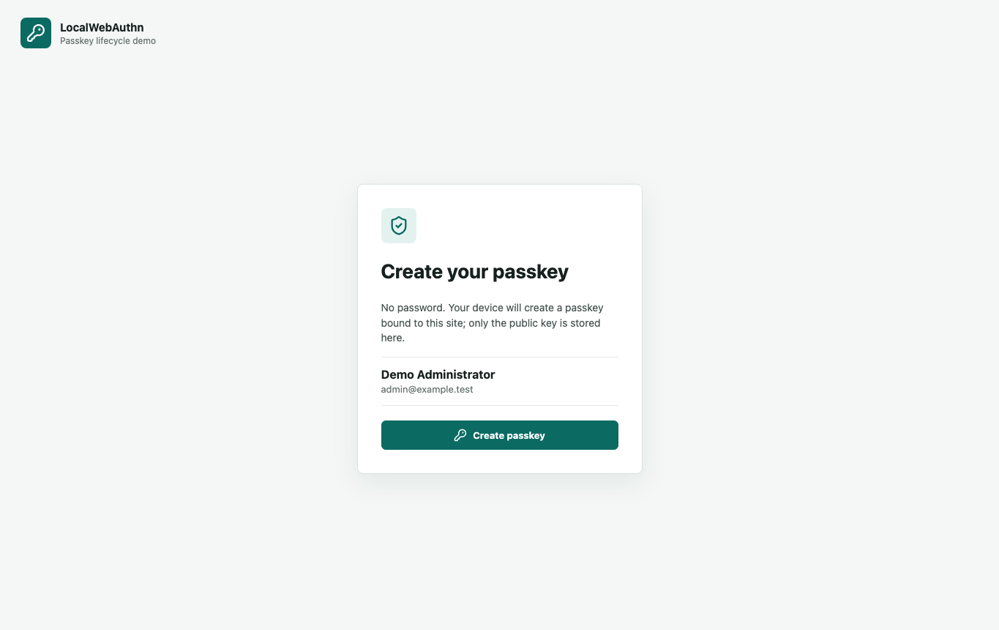
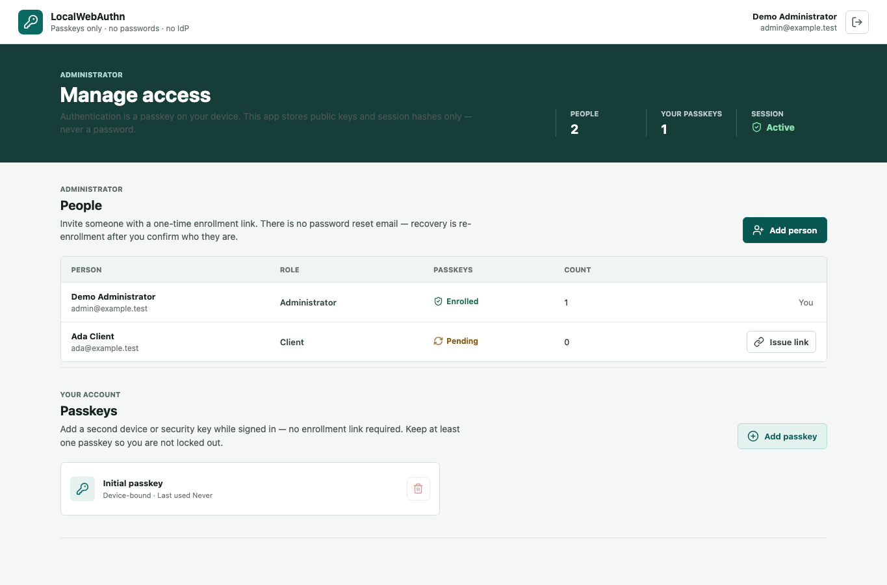
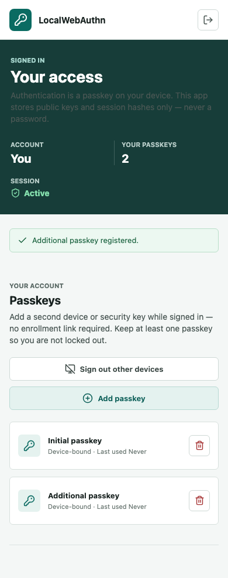
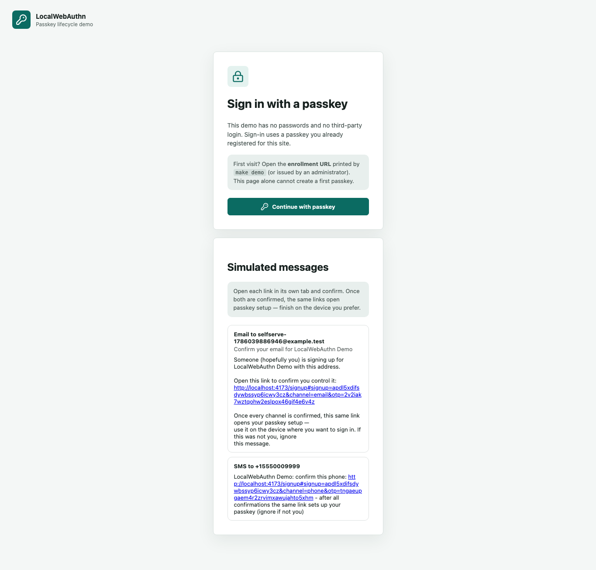
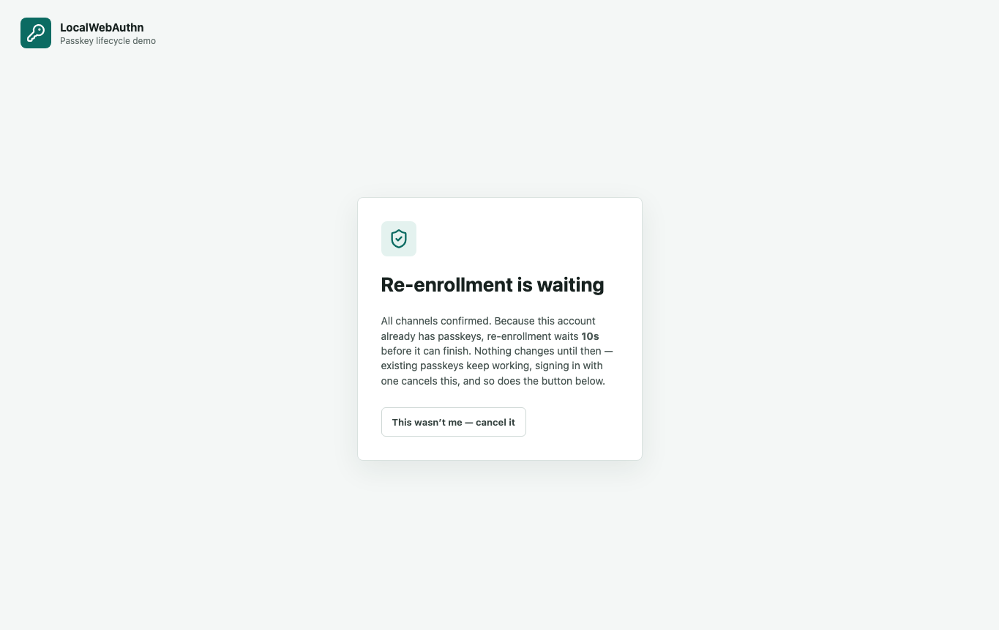
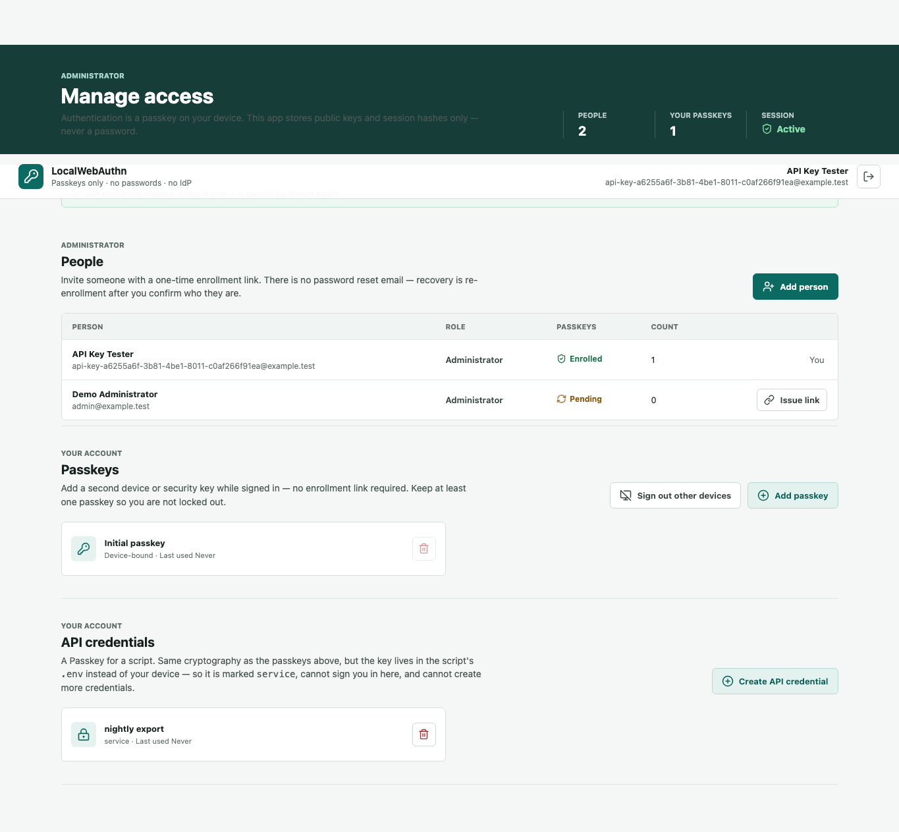

#+title: LocalWebAuthn
#+author: Perry Kundert
#+category: LocalWebAuthn

#+STARTUP: org-startup-with-inline-images inlineimages
#+OPTIONS: ^:nil # Disable sub/superscripting with bare _; _{...} still works
#+OPTIONS: toc:2

*Default to passkeys, not password plumbing.*

[[https://www.npmjs.com/package/@localwebauthn/server][npm: @localwebauthn/server]] ·
[[https://www.npmjs.com/package/@localwebauthn/browser][npm: @localwebauthn/browser]] ·
[[https://github.com/LocalWebAuthn/LocalWebAuthn/actions/workflows/ci.yml][CI]] ·
[[./LICENSE][MIT]] · =2.2.0=

LocalWebAuthn is a self-hosted, invitation-first, passkey-only authentication lifecycle for
TypeScript applications.  It supplies what is missing between a WebAuthn ceremony library
and a logged-in user: enrollment, credentials, challenges, sessions, revocation, and
SQLite, PostgreSQL or Cloudflare D1 persistence.

Your application keeps its users and its authorization rules.  It keeps no passwords, no
password hashes, no reset tokens, no TOTP seeds and no recovery codes.  It stores public
keys and hashes of opaque tokens, and *no value in the database can be replayed as a
passkey*.

This page builds one application up in order: why passkeys, what the running demo looks
like, then the smallest server and browser code that authenticates a person, then a second
passkey, then a Passkey for a script that has no browser and no human.  Each step adds one
idea.  Deeper treatment of every option lives in the two detail documents:

- [[./README-DETAIL.org][README-DETAIL.org]] --- deployment and use options: adapters,
  cookies and origins, sessions, suspension, recovery design, self-serve signup, credential
  kinds, DPoP, heritage, audit events, migrations.
- [[./README-DETAIL-EXAMPLES.org][README-DETAIL-EXAMPLES.org]] --- the five worked
  examples, what each one is for, and how to run it.

* Passkeys instead of passwords

A password field is not one feature.  It commits an application to hashing, policy, reset
and recovery flows, email delivery, credential-stuffing defence, breach response, and
usually a second factor.  A prototype ships the first piece and inherits the rest as
production risk.

A passkey starts from a different place.  The authenticator --- a phone's secure element, a
laptop's TPM, a hardware key, a password manager --- generates a key pair per site and keeps
the private half.  The server stores only the public key.  Signing in means signing a
random challenge that the browser binds to the origin it is talking to, so a signature
produced for =evil.example= is worthless at =app.example.com=.  These are properties of the
[[https://www.w3.org/TR/webauthn-3/][WebAuthn standard]], not of this package.

| Password application                        | LocalWebAuthn                                       |
|---------------------------------------------+-----------------------------------------------------|
| =users.password_hash=                       | a public key in =localwebauthn_credentials=         |
| =bcrypt.hash()= at signup                   | the authenticator generates the key pair            |
| =bcrypt.compare()= at login                 | =verifyAuthentication({ response, challengeToken })= |
| a reusable secret the user can be phished for | a signature bound to one origin, valid once        |
| reset tokens and a mail channel             | an explicit re-enrollment policy you define         |
| bolt-on TOTP                                | =userVerification: 'required'=, done by the device  |
| breach discloses verifiers                  | breach discloses public keys                        |

Two consequences are worth stating plainly, because they are what actually changes in your
code.

*Signing in takes two requests instead of one.*  A password can just be sent.  A passkey
proves possession of a key, so the server issues a challenge first and verifies a signature
over it second:

#+begin_src text
password   POST /login          {username, password}   -> Set-Cookie: session

passkey    POST /login/options  {}                     -> challenge + Set-Cookie: challenge
             (the device prompts: Touch ID, Windows Hello, a security key, a password manager)
           POST /login/verify   {signed assertion}     -> Set-Cookie: session
#+end_src

*Sign-in submits no username.*  Passkeys are discoverable: the authenticator already knows
which account it holds for your site, so the user picks it in the browser's own UI.
=POST /login/options= takes an empty body.  There is no username-enumeration surface and no
per-username rate limit to write --- rate limit the route.

What you give up is the free reset email.  There is no shared secret to reset, so recovery
means issuing a fresh enrollment link, which is identity proofing your application has to
define.  It is the one design decision this package deliberately refuses to make for you;
[[./README-DETAIL.org][README-DETAIL.org]] has a section on getting it right, and the
cheapest answer --- a second passkey, enrolled before anything is lost --- appears below.

Passkeys do not remove application security.  A stolen session or a stolen enrollment link
is still a bearer capability, a compromised server can still hijack future sessions, and
recovery remains policy.  The narrow claim is the useful one: *your server never receives or
stores a reusable user authentication secret.*

* See it running

#+begin_src sh
git clone https://github.com/LocalWebAuthn/LocalWebAuthn.git
cd LocalWebAuthn
nix develop
make demo
#+end_src

The demo listens on =http://localhost:4173= and keeps a disposable SQLite database under
=examples/demo/.data/=.  It prints one URL:

#+begin_src text
Initial administrator enrollment URL:
http://localhost:4173/enroll#token=...
#+end_src

The recording stops where WebAuthn begins --- terminal recorders cannot capture a native
passkey prompt.  Open that URL and the browser consumes the fragment, removes it from
history, and asks the platform authenticator to create the administrator's passkey:

Signed in, the same page is the whole lifecycle: invite a person with a one-time link, watch
their passkey count, end sessions without touching credentials, and re-enroll after a loss.

Any signed-in person can add another passkey --- a second device, or a hardware key that
lives in a drawer.  No link, no administrator, no identity proofing:

#+ATTR_HTML: :width 390

The demo also simulates self-serve signup.  Two confirmation messages render as an on-screen
inbox rather than being sent; each link proves control of one channel, and only after both
confirmations do the same links open passkey setup:

Re-proofing an account that *already* has passkeys is recovery, so it behaves differently:
completion opens a waiting period in which nothing changes, any channel can veto it, and so
does signing in with an existing passkey.

Finally, a person can mint a Passkey for a script.  It is listed apart from their own
passkeys and marked =service=, because the server knows it is not a person:

The whole sequence is an executable Playwright test using Chromium virtual authenticators
--- four specs covering the lifecycle, self-serve signup and recovery, and the API
credential end to end including the real CLI script:

#+begin_src sh
nix develop
make test-demo-install   # once: Playwright Chromium
make test-demo
#+end_src

Play the terminal recording with =asciinema play docs/demo.cast=; see
[[./docs/DEMO.md][docs/DEMO.md]] to reproduce the media.

* Step 1: the service

Install the two packages an interactive application needs:

#+begin_src sh
npm install @localwebauthn/server @localwebauthn/browser
#+end_src

Keep the identity fields your application actually needs.  There is deliberately no password
column, and one new one --- a stable 32-byte handle WebAuthn uses to name the account:

#+begin_src sql
CREATE TABLE app_users (
  id TEXT PRIMARY KEY,
  email TEXT NOT NULL UNIQUE,
  display_name TEXT NOT NULL,
  webauthn_user_handle BLOB NOT NULL UNIQUE,
  active INTEGER NOT NULL DEFAULT 1
);
#+end_src

Now construct the service.  It needs three facts about your site, a store, and a way to look
up one of your users:

#+begin_src ts
import Database from 'better-sqlite3';
import { LocalWebAuthn } from '@localwebauthn/server';
import { migrateSqlite, SqliteLocalWebAuthnStore } from '@localwebauthn/server/sqlite';

const database = new Database('application.db');
migrateSqlite(database); // idempotent; safe on every start

export const auth = new LocalWebAuthn({
  rpName: 'Example',
  rpId: 'app.example.com',
  expectedOrigins: 'https://app.example.com',
  store: new SqliteLocalWebAuthnStore(database),
  users: {
    async getUser(userId) {
      const user = await applicationUsers.get(userId);
      return (
        user && {
          id: user.id,
          name: user.email,
          displayName: user.displayName,
          webAuthnUserHandle: user.webAuthnUserHandle,
          active: user.active,
        }
      );
    },
  },
});
#+end_src

That is the whole configuration.  =rpId= is the bare hostname credentials are bound to,
=expectedOrigins= is what the browser must claim, and =getUser= is the only place your user
table is touched --- returning =active: false= from it refuses every ceremony and every
session for that person, which is how you suspend someone.

PostgreSQL and D1 are drop-in replacements for =store=; see
[[./README-DETAIL.org][README-DETAIL.org]].

* Step 2: signing in

Two routes, mirroring the two-request shape above.  The challenge has to survive between
them, so the service hands you a =challengeToken= to put in a short-lived cookie and keeps
only its hash:

#+begin_src ts
import { authCookieNames, cookieAttributes } from '@localwebauthn/server';
import { deleteCookie, getCookie, setCookie } from 'hono/cookie';

const publicOrigin = 'https://app.example.com';
const names = authCookieNames(publicOrigin); // __Host-lwa_challenge, _enrollment, _session
const attrs = (expiresAt?: number) => cookieAttributes({ publicOrigin, expiresAt });

app.post('/api/auth/login/options', async (c) => {
  const { options, challengeToken, expiresAt } = await auth.authenticationOptions();
  setCookie(c, names.challenge, challengeToken, attrs(expiresAt));
  return c.json(options);
});

app.post('/api/auth/login/verify', async (c) => {
  const challengeToken = getCookie(c, names.challenge) ?? '';
  deleteCookie(c, names.challenge, attrs());
  const result = await auth.verifyAuthentication({
    response: await c.req.json(),
    challengeToken,
  });
  setCookie(c, names.session, result.sessionToken, attrs(result.expiresAt));
  return c.json({ verified: true });
});
#+end_src

=authCookieNames= and =cookieAttributes= exist so every application gets the same answer:
=HttpOnly=, =SameSite=Strict=, =Secure= and the =__Host-= prefix on HTTPS, plain names on
localhost because browsers reject =__Host-= without =Secure=.  Do not re-derive those flags.

Guarding your own routes is one call.  =resolveSession= returns =null= for a session that is
expired, idle, revoked, belonging to a revoked credential, or belonging to a suspended user
--- so there is one thing to check:

#+begin_src ts
app.use('/api/*', async (c, next) => {
  const resolved = await auth.resolveSession(getCookie(c, names.session) ?? '');
  if (!resolved) {
    return c.json({ error: 'unauthenticated' }, 401);
  }
  c.set('user', resolved.user);
  await next();
});
#+end_src

Signing out is =auth.revokeSession(token)= plus clearing the cookie.

Every failure from the service is a =LocalWebAuthnError= carrying a =code= and an HTTP
=status=, so one error mapper turns them into JSON without leaking which part of a ceremony
failed:

#+begin_src ts
import { isLocalWebAuthnError } from '@localwebauthn/server';

if (isLocalWebAuthnError(error)) {
  return c.json({ error: error.code, message: error.message }, error.status);
}
#+end_src

* Step 3: the first passkey

Sign-in needs a passkey to exist.  The first one always comes from an *enrollment grant*: a
single-use, expiring, hashed link bound to exactly one user.  Your application decides who
may create users and how that link is approved and delivered --- that is identity proofing,
and it is yours.

#+begin_src ts
import { createUserHandle } from '@localwebauthn/server';

const user = await applicationUsers.create({
  email: 'ada@example.com',
  displayName: 'Ada Lovelace',
  webAuthnUserHandle: createUserHandle(),
});

const { enrollmentUrl } = await auth.issueEnrollment(user.id);
// https://app.example.com/enroll#token=...   (single use, 30 minutes by default)
#+end_src

The secret rides in the URL *fragment*, which browsers never send to a server and never put
in a =Referer=.  The page reads it, exchanges it for an enrollment cookie, and then runs the
same options/verify pair as sign-in --- =registrationOptions= instead of
=authenticationOptions=:

#+begin_src ts
app.post('/api/auth/enrollment/exchange', async (c) => {
  const { token } = await c.req.json<{ token?: string }>();
  const result = await auth.exchangeEnrollment(token ?? '');
  setCookie(c, names.enrollment, result.enrollmentSessionToken, attrs(result.expiresAt));
  return c.json(result.user);
});

app.post('/api/auth/register/options', async (c) => {
  const result = await auth.registrationOptions({
    enrollmentSessionToken: getCookie(c, names.enrollment),
    sessionToken: getCookie(c, names.session), // for an already-signed-in person
  });
  setCookie(c, names.challenge, result.challengeToken, attrs(result.expiresAt));
  return c.json(result.options);
});

app.post('/api/auth/register/verify', async (c) => {
  const challengeToken = getCookie(c, names.challenge) ?? '';
  deleteCookie(c, names.challenge, attrs());
  const result = await auth.verifyRegistration({
    response: await c.req.json(),
    challengeToken,
    enrollmentSessionToken: getCookie(c, names.enrollment),
    sessionToken: getCookie(c, names.session),
    label: 'Primary passkey',
  });
  deleteCookie(c, names.enrollment, attrs());
  setCookie(c, names.session, result.sessionToken, attrs(result.expiresAt));
  return c.json({ verified: true }, 201);
});
#+end_src

Registration ends signed in: a passkey was just proved, so demanding an immediate sign-in
would be theatre.

That is five routes; add =POST /api/auth/logout= and you have all six that
=@localwebauthn/browser= speaks by default.  The browser side of the entire lifecycle is
then this:

#+begin_src ts
import { consumeEnrollmentToken, LocalWebAuthnBrowser } from '@localwebauthn/browser';

const auth = new LocalWebAuthnBrowser();
const token = consumeEnrollmentToken(window.location, window.history);

if (token) {
  await auth.exchangeEnrollment(token);
  await auth.registerPasskey('Primary passkey');
} else {
  await auth.signIn();
}
#+end_src

=consumeEnrollmentToken= reads the fragment and replaces it in history, so a shoulder-surfed
address bar and the back button both come up empty.  There is no hidden behaviour in
=LocalWebAuthnBrowser=: it POSTs to those six paths, and nothing happens that your handler
did not do.  Change the prefix with =new LocalWebAuthnBrowser({ basePath: '/auth' })=.

A complete, copyable version of these six routes is
[[./examples/starter-hono/src/auth-routes.ts][examples/starter-hono/src/auth-routes.ts]] ---
164 lines including error handling and the exact-origin check.

* Step 4: more passkeys

Once a person is signed in, adding another passkey needs no link and no proofing, because
the session is already proof:

#+begin_src ts
await auth.registerPasskey('Backup security key');
#+end_src

Same call, same two routes.  The only difference is that =registrationOptions= was given a
=sessionToken= rather than an =enrollmentSessionToken=.

This is the most valuable paragraph in this document.  *A second passkey, enrolled before
anything goes wrong, is the recovery flow you never have to operate.*  A hardware key in a
drawer or a second device costs the user thirty seconds at enrollment; the alternative is a
high-assurance recovery desk that an attacker will target precisely because it is easier
than the front door.  Prompt for it during enrollment.

Losing the last passkey is what recovery is for, and =revokeCredential= refuses to remove a
person's only one unless you say =allowLastCredential: true= --- so the lockout has to be
deliberate.  The three revocation verbs, in increasing severity:

| Call                                       | Ends            | Leaves               |
|--------------------------------------------+-----------------+----------------------|
| =revokeSession(token)=                     | one session     | everything else      |
| =revokeUserSessions(userId)=               | every session   | every passkey        |
| =revokeUserAuthentication(userId)=         | sessions, passkeys, pending grants | a user who must re-enroll |

=revokeUserSessions= is the "my laptop was stolen" button: the person signs in again on
their phone and nothing needs re-issuing.  Reach for =revokeUserAuthentication= only when
the credentials themselves must go, and issue the fresh enrollment link *after* it --- it
revokes pending grants, so the other order destroys the link you just made.

Recovery design --- why the bar has to be high, the administrator-initiated pattern, the
two-channel pattern, and the failure modes of each --- is in
[[./README-DETAIL.org][README-DETAIL.org]].

* Step 5: a Passkey for a script

#+begin_quote
*Unreleased.*  Everything in this section --- =credentialKinds=, =verifyDpop=,
=@localwebauthn/client= --- lands in the next release.  =2.2.0= has the four steps above.
#+end_quote

A WebAuthn assertion is a signature over =authenticatorData ‖ SHA-256(clientDataJSON)=.
Producing one needs a private key and about sixty lines of code --- not a browser, not a
human, not a biometric.  So the same mechanism authenticates a nightly export script, with
one honest change: the server records what *class* of credential it is, because everything a
software authenticator says about itself is self-asserted and therefore worthless as a
control.

#+begin_src sh
npm install @localwebauthn/client   # only the script's host needs this
#+end_src

** What the server declares

One new option turns the label =service= into a set of restrictions:

#+begin_src ts
export const auth = new LocalWebAuthn({
  // ... as before
  credentialKinds: {
    service: {
      interactive: false, // cannot sign in at the browser route, which names no kind
      canRegister: false, // cannot enroll another credential; a leaked key cannot breed
      sessionAbsoluteMs: 15 * 60_000, // short sessions; the client re-authenticates on 401
    },
  },
  dpopNonce: { rotationMs: 60_000 }, // optional; see below
});
#+end_src

=kind= is the only fact about a credential's class that a hostile key holder cannot forge,
because the server chose it.  =userVerified=, =origin=, the backup flags and the signature
counter are all claims the signer makes about itself.

Your session middleware must also refuse machine credentials at browser routes.  The package
cannot do it for you --- a script can present a session cookie and write its own =Origin= ---
but it tells you which kinds are interactive:

#+begin_src ts
if (!auth.interactiveKind(resolved.session.credentialKind)) {
  return c.json({ error: 'forbidden' }, 403);
}
#+end_src

** Minting one in the browser

The person's own passkey authorizes the creation; the *page* generates the new key pair, so
the private half is never sent anywhere.  The route supplies the kind --- never the request
body, or the client would classify itself:

#+begin_src ts
// Server: two routes, gated on a fresh assertion from a person.
const options = await auth.registrationOptions({ sessionToken, credentialKind: 'service' });
const result = await auth.verifyRegistration({ response, challengeToken, sessionToken, label });
#+end_src

#+begin_src ts
// Browser: generate, register, then hand the key to the human exactly once.
import {
  createRegistrationResponse,
  encodeBase64Url,
  ES256,
  formatCredentialFile,
  generateKeyStore,
} from '@localwebauthn/client';

const { keyStore, exportPrivateKey } = await generateKeyStore(ES256);
const { response, credentialId } = await createRegistrationResponse({
  keyStore,
  challenge: options.challenge,
  rpId: options.rp.id,
  origin: window.location.origin,
});
await post('/api/api-keys/verify', { response, challengeToken, label });

const env = formatCredentialFile(
  {
    v: 1,
    baseUrl: window.location.origin,
    rpId: options.rp.id,
    origin: window.location.origin,
    credentialId: encodeBase64Url(credentialId),
    userHandle: options.user.id,
    alg: ES256,
  },
  await exportPrivateKey(),
  label,
);
#+end_src

=env= is two lines --- public metadata as JSON, private key as base64 --- for the script's
=.env= file:

#+begin_src sh
# nightly export -- created 2026-08-08T21:00:00.000Z
LWA_CREDENTIAL='{"v":1,"baseUrl":"https://app.example.com","rpId":"app.example.com", ... }'
LWA_CREDENTIAL_KEY=MIGHAgEAMBMGByqGSM49AgEGCCqGSM49AwEHBG0wawIBAQQg...
#+end_src

One piece of private key material, in one place.  The server holds a COSE public key and
could not reissue this even if asked, which is why the page says *copy this now*.

** The script

#+begin_src ts
import { importKeyStore, MachineClient, parseCredentialFile, parseCredentialPayload }
  from '@localwebauthn/client';
import { readFile } from 'node:fs/promises';

const file = parseCredentialFile(await readFile('.env', 'utf8'))!;
const payload = parseCredentialPayload(file.payload);
const client = new MachineClient({
  payload,
  keyStore: await importKeyStore(file.key, payload.alg),
});

await client.authenticate();                            // one full WebAuthn ceremony
const me = await client.fetch('/api/machine/v1/whoami'); // DPoP proof per request
#+end_src

=authenticate()= runs the real ceremony in software and gets an ordinary session token.
Every request after it carries a
[[https://www.rfc-editor.org/rfc/rfc9449.html][RFC 9449 DPoP]] proof signed by the *same*
key, which is what makes a stolen session token useless on its own.  The server stores
nothing per session for this: the expected key thumbprint is derived from the credential's
stored public key.

Server side, the machine guard is =resolveSession= plus one call:

#+begin_src ts
import { dpopChallenge, isLocalWebAuthnError } from '@localwebauthn/server';

try {
  await auth.verifyDpop({
    proof: c.req.header('DPoP'),
    method: c.req.method,
    url: c.req.url,
    sessionToken: token,
    session: resolved.session,
    requireNonce: true,
  });
} catch (error) {
  if (isLocalWebAuthnError(error) && error.code === 'dpop_nonce_required') {
    // RFC 9449 §8: hand out a nonce and let the client retry once.
    return c.json({ error: error.code }, 401, dpopChallenge(await auth.dpopNonce()));
  }
  throw error;
}
#+end_src

Nonces are opt-in because they cost the client something real --- it must retain the latest
=DPoP-Nonce= and retry when challenged.  =MachineClient= already does both.

** What this buys, precisely

| Threat                                    | What stops it                                                    |
|-------------------------------------------+------------------------------------------------------------------|
| the =.env= leaks                          | revoke that one credential; nothing else changes                 |
| a stolen session token is replayed        | every request needs a DPoP proof from the credential's key       |
| a captured proof is replayed              | the =jti= is single-use; =htm=, =htu= and =ath= bind it to one request |
| a leaked key mints itself a spare         | =canRegister: false=                                             |
| a script signs in at the browser route    | =interactive: false=                                             |
| a script calls a cookie route with its token | your =interactiveKind= check                                   |
| the server database is read               | it holds a public key; no secret to steal                        |

The full design --- every byte of both flows, key custody options from a file to a TPM, and
the reasoning behind each restriction --- is
[[./docs/API-AUTH.org][docs/API-AUTH.org]] (also as
[[./docs/API-AUTH.pdf][PDF]] and [[./docs/api-auth.txt][plain text]]).  A runnable version of
everything above is the demo's =/api/api-keys/*= and =/api/machine/v1/*= routes plus
[[./examples/demo/scripts/api-client.ts][examples/demo/scripts/api-client.ts]], which prints
every byte it constructs under =--dry-run=.

* Where to go from here

| Document                                                                  | For                                                                                |
|---------------------------------------------------------------------------+------------------------------------------------------------------------------------|
| [[./README-DETAIL.org][README-DETAIL.org]]                                | Adapters, cookies, sessions, suspension, recovery design, signup, kinds, DPoP, audit |
| [[./README-DETAIL-EXAMPLES.org][README-DETAIL-EXAMPLES.org]]              | The five examples and what each one teaches                                        |
| [[./docs/API-AUTH.org][docs/API-AUTH.org]]                                | The machine-credential design in full                                              |
| [[./SECURITY.md][SECURITY.md]]                                            | Security boundary, host duties, reporting, what to read before depending on this   |
| [[./docs/MIGRATING.md][docs/MIGRATING.md]]                                | Upgrade notes, schema versions, store-contract changes                             |
| [[./docs/COMPARISON.md][docs/COMPARISON.md]]                              | How this differs from ceremony libraries, auth frameworks and hosted IdPs          |
| [[./docs/RATIONALE.md][docs/RATIONALE.md]]                                | Why the boundary sits where it does; non-goals                                     |

*Is this a good fit?*  Yes, if you want to replace a password system with passkeys only,
keep authentication in your own TypeScript app and database, enroll each person through an
explicit one-time grant, and treat recovery as identity proofing plus re-enrollment.  That
covers internal tools, admin surfaces, B2B apps with deliberate onboarding, consumer
products that verify contact details at signup, and small production apps whose users are
passkey-capable.

Choose a mature identity provider instead when you need federation, directory integration,
regulated identity assurance, high-volume abuse operations, permanent password or OAuth
fallbacks, or recovery your team cannot safely operate.  Do not make passkey-only access
mandatory for a population whose devices and accessibility needs you have not checked.

*A stable API is not a production track record.*  The current release is =2.2.0=, and
LocalWebAuthn follows SemVer for the service API, store contract and schema --- but it is
young software with a small user base sitting on the authentication path.  It is also deliberately small enough to read
--- about 6,000 lines in the server package, 180 in the browser package, 1,000 in the
optional client.  Read it, and read [[./SECURITY.md][SECURITY.md]], before depending on it.

*If you are on 1.0.0 or 1.1.0, upgrade.*  Those releases delete passkeys during routine
maintenance; see [[./docs/MIGRATING.md][the 2.0.0 notes]].

* Packages and development

- [[./packages/server][=@localwebauthn/server=]] --- the framework-neutral lifecycle, plus
  conforming SQLite, PostgreSQL and D1 stores exported from =/sqlite=, =/postgres= and =/d1=.
- [[./packages/browser][=@localwebauthn/browser=]] --- enrollment, registration,
  authentication and logout over the six-route protocol.
- [[./packages/client][=@localwebauthn/client=]] --- the software authenticator, DPoP proofs,
  the two-line credential file and =MachineClient=.  Only for deployments issuing API
  credentials; publishes with the next release.

This repository is an npm workspace; the packages are versioned together.

#+begin_src sh
nix develop
make help
make test                        # unit + store adapters + channel examples
pg-start && make test-postgres   # add live PostgreSQL conformance
make test-demo-install           # once: Playwright Chromium
make test-demo                   # browser lifecycle end to end
make check                       # typecheck, lint, format, coverage, package gates
#+end_src

Outside the flake shell, wrap any target: =make nix-test=, =make nix-check=.  Releases use
npm OIDC Trusted Publishing --- no long-lived write token --- and are triggered by a
versioned GitHub Release; see [[./docs/RELEASING.md][docs/RELEASING.md]] and
[[./CHANGELOG.md][CHANGELOG.md]].
