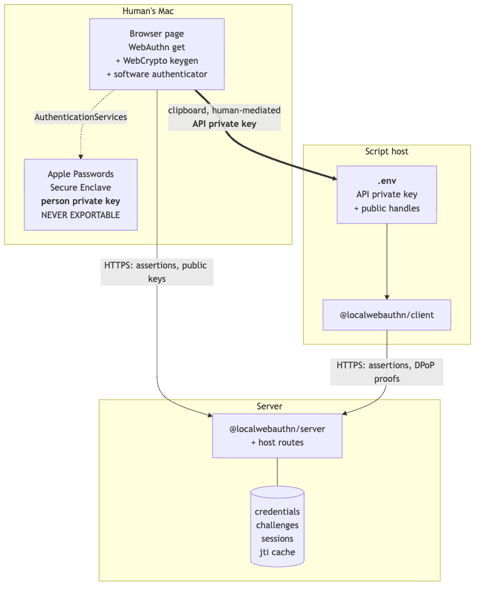
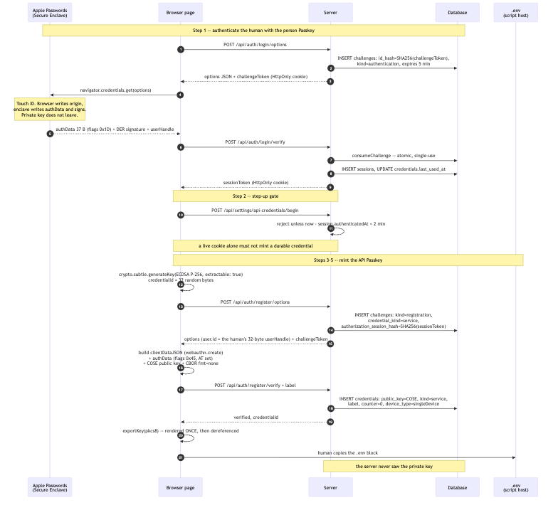
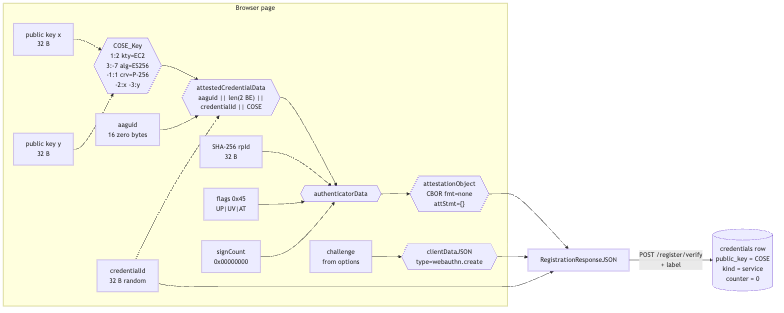
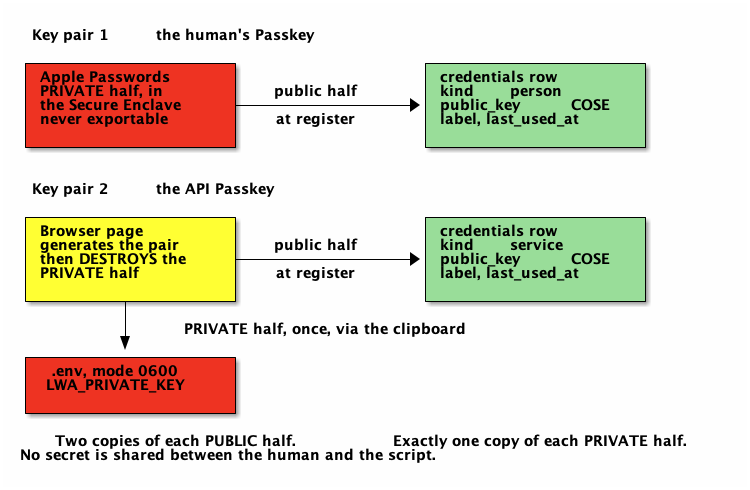
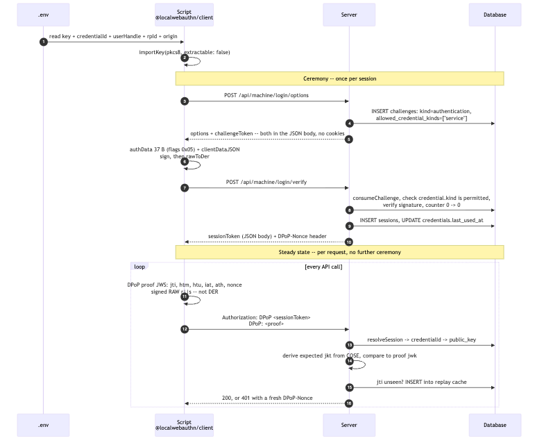
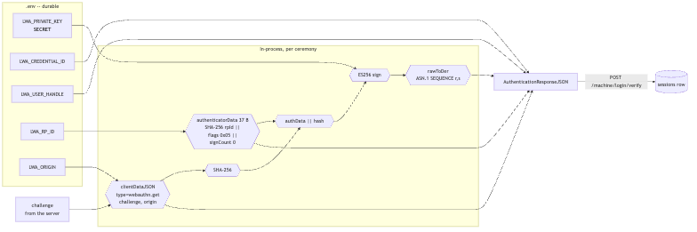
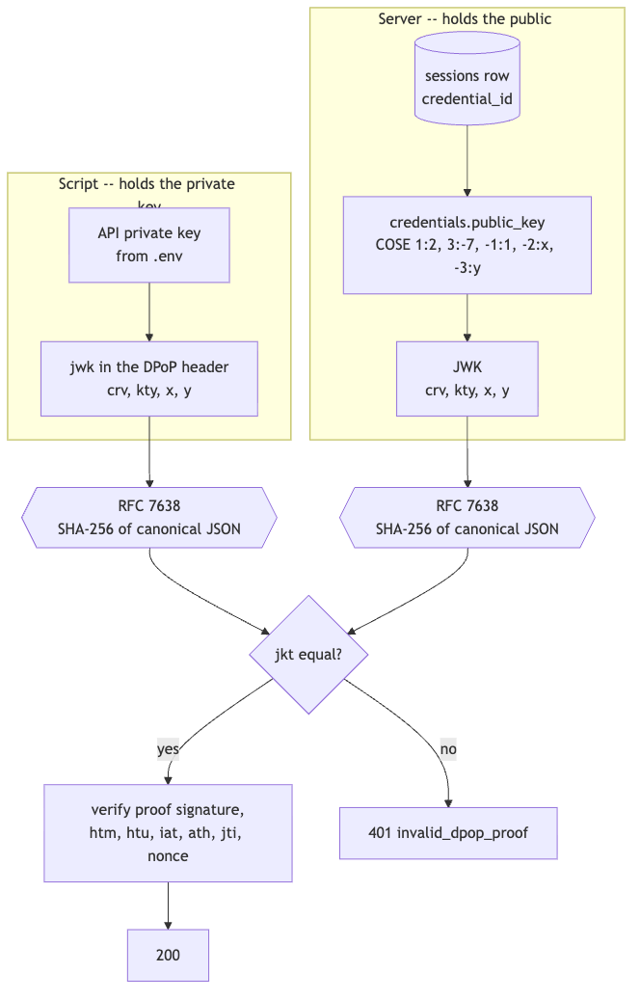
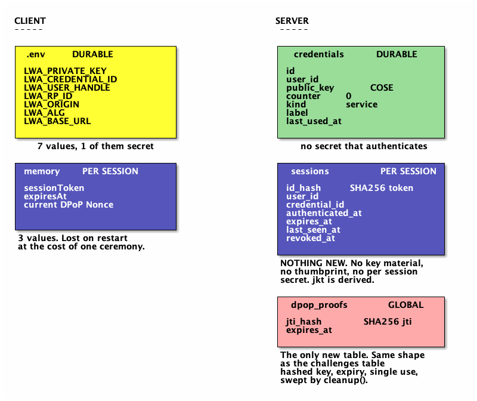

#+title: API Access via Software Passkeys
#+author: Perry Kundert
#+date: 2026-08-08
#+category: LocalWebAuthn
#+series[]: LocalWebAuthn

#+EXPORT_FILE_NAME: ./api-auth
#+STARTUP: org-startup-with-inline-images inlineimages
#+STARTUP: org-latex-tables-centered nil
#+OPTIONS: ^:nil # Disable sub/superscripting with bare _; _{...} still works
#+OPTIONS: toc:nil

#+LATEX_HEADER: \usepackage[margin=1.0in]{geometry}

#+BEGIN_ABSTRACT
A WebAuthn assertion is a signature over =authenticatorData || SHA-256(clientDataJSON)=.
Producing one needs a private key and about sixty lines of code -- no browser, no
human, no biometric.  This memo specifies how a person whose Passkey lives in the
macOS Passwords keystore provisions a /second/ Passkey for a headless script, where
every byte of that exchange flows, and what each side must remember afterwards.

The human's Passkey is a synced platform credential, reachable only through
=navigator.credentials.get()=.  It signs one kind of object and can never sign on the
script's behalf; its role is to /authorize/, once, the creation of the API credential.
That credential's private key is generated in the browser page, displayed exactly
once, and pasted into the script's =.env=.  One piece of private key material, in one
place.  The server holds only a COSE public key -- it never possesses a secret that
authenticates.

At runtime the script performs the full WebAuthn ceremony in software, and /the same
key/ signs the per-request DPoP proofs (RFC 9449).  That single-key choice yields the
central result: the server stores *nothing* per session beyond the ordinary
=sessions= row.  The DPoP key thumbprint is /derived/ from =credentials.public_key=,
not stored, so the per-request check reduces to "this proof was signed by the same key
that produced the assertion that opened this session."  The only new server state in
the entire design is a =jti= replay cache -- structurally the same row the challenge
table already is.
#+END_ABSTRACT

#+LATEX: \clearpage
#+TOC: headlines 3

#+LATEX: \clearpage
* Status

Design document.  Describes the intended system, not the shipped one.

As of =@localwebauthn/server@2.2.0=, =Credential.label= and =Credential.lastUsedAt=
exist and do everything this design needs of them.  The =kind= column does not exist
([[https://github.com/LocalWebAuthn/LocalWebAuthn/issues/11][issue #11]]), there is no
=@localwebauthn/client= package, and there is no DPoP support.  Items marked
/proposed/ are new work; everything else is a call that exists today.

Companion documents in =docs/API-AUTH/=: three independent design treatments, a
consensus analysis with the standards survey, and the provisioning discussion this
document supersedes.

* Overview

** Principals

#+BEGIN_SRC mermaid :file ./images/api-auth-principals.png
flowchart TB
  subgraph mac["Human's Mac"]
    direction LR
    SE["Apple Passwords Secure Enclave <b>person private key</b> NEVER EXPORTABLE"]
    BR["Browser page WebAuthn get + WebCrypto keygen + software authenticator"]
    BR -.->|"AuthenticationServices"| SE
  end

  subgraph srv["Server"]
    SV["@localwebauthn/server + host routes"]
    DB[("credentials challenges sessions jti cache")]
    SV --- DB
  end

  subgraph host["Script host"]
    EV["<b>.env</b> API private key + public handles"]
    CL["@localwebauthn/client"]
    EV --> CL
  end

  BR -->|"HTTPS: assertions, public keys"| SV
  BR ==>|"clipboard, human-mediated <b>API private key</b>"| EV
  CL -->|"HTTPS: assertions, DPoP proofs"| SV
#+END_SRC

#+RESULTS:

The thick edge is the only path the API private key ever travels: /page memory ->
clipboard -> file/.  It does not pass through the server, and the server has no
column that could hold it.

** The two credentials

| Property               | Human Passkey                         | API Passkey                       |
|------------------------+---------------------------------------+-----------------------------------|
| Key custody            | Apple Passwords, Secure Enclave       | =.env= on the script host         |
| Reachable from         | a browser, only                       | any process that can read =.env=  |
| =kind= (/proposed/)    | =person=                              | =service=                         |
| =label=                | "Perry's MacBook"                     | "Perry's Blah maintenance script" |
| =deviceType=           | =multiDevice=                         | =singleDevice=                    |
| =backedUp=             | =true=                                | =false=                           |
| =signCount=            | =0= forever; iCloud keeps no counter  | =0= by policy                     |
| =userVerified=         | =true=, attested by Touch ID          | =true=, self-asserted by a program |
| =origin= in clientData | written by the /browser/              | written by the /script/           |
| Signs                  | assertions, browser-mediated          | assertions + DPoP proofs          |

Both rows report =userVerified: true=, and it means something entirely different on
each.  That is what =kind= exists to record.

#+LATEX: \clearpage
* Part 1: A Human Provisions an API Passkey

** Preconditions

- Server configured =rpId = app.example.com=, =expectedOrigins =
  ['https://app.example.com']=.
- The human holds a =kind='person'= credential, private key in Apple Passwords.
- =getUser(userId)= returns them =active: true= with a stable 32-byte
  =webAuthnUserHandle=.

** End-to-end data flow

#+BEGIN_SRC mermaid :file ./images/api-auth-provision.png
sequenceDiagram
  autonumber
  participant SE as Apple Passwords (Secure Enclave)
  participant BR as Browser page
  participant SV as Server
  participant DB as Database
  participant EV as .env (script host)

  Note over SE,DB: Step 1 -- authenticate the human with the person Passkey

  BR->>SV: POST /api/auth/login/options
  SV->>DB: INSERT challenges: id_hash=SHA256(challengeToken), kind=authentication, expires 5 min
  SV-->>BR: options JSON + challengeToken (HttpOnly cookie)
  BR->>SE: navigator.credentials.get(options)
  Note over SE: Touch ID. Browser writes origin, enclave writes authData and signs. Private key does not leave.
  SE-->>BR: authData 37 B (flags 0x1D) + DER signature + userHandle
  BR->>SV: POST /api/auth/login/verify
  SV->>DB: consumeChallenge -- atomic, single-use
  SV->>DB: INSERT sessions, UPDATE credentials.last_used_at
  SV-->>BR: sessionToken (HttpOnly cookie)

  Note over BR,SV: Step 2 -- step-up gate

  BR->>SV: POST /api/settings/api-credentials/begin
  SV->>SV: reject unless now - session.authenticatedAt < 2 min
  Note over BR,SV: a live cookie alone must not mint a durable credential

  Note over BR,EV: Steps 3-5 -- mint the API Passkey

  BR->>BR: crypto.subtle.generateKey(ECDSA P-256, extractable: true) credentialId = 32 random bytes
  BR->>SV: POST /api/auth/register/options
  SV->>DB: INSERT challenges: kind=registration, credential_kind=service, authorization_session_hash=SHA256(sessionToken)
  SV-->>BR: options (user.id = the human's 32-byte userHandle) + challengeToken
  BR->>BR: build clientDataJSON (webauthn.create) + authData (flags 0x45, AT set) + COSE public key + CBOR fmt=none
  BR->>SV: POST /api/auth/register/verify + label
  SV->>DB: INSERT credentials: public_key=COSE, kind=service, label, counter=0, device_type=singleDevice
  SV-->>BR: verified, credentialId
  BR->>BR: exportKey(pkcs8) -- rendered ONCE, then dereferenced
  BR->>EV: human copies the .env block
  Note over SV,DB: the server never saw the private key
#+END_SRC

#+RESULTS:

** Step 1: authenticate the human

| Runs on | browser -> macOS -> Secure Enclave -> server |
| Code    | =LocalWebAuthnBrowser.signIn()=, =auth.authenticationOptions()=, =auth.verifyAuthentication()= |

The layer split /is/ the phishing resistance, and it is why this key can never serve
the script:

#+BEGIN_SRC text
  BROWSER writes clientDataJSON:
    {"type":"webauthn.get",
     "challenge":"<echoed verbatim from options>",
     "origin":"https://app.example.com",     <-- the BROWSER asserts this
     "crossOrigin":false}

  AUTHENTICATOR writes authenticatorData, 37 bytes:
    [0..32)  SHA-256("app.example.com")
    [32]     0x1D = UP|UV|BE|BS
    [33..37) 0x00000000  signCount

  AUTHENTICATOR signs, inside the enclave:
    ES256( authenticatorData || SHA-256(clientDataJSON) )   -- ASN.1 DER
#+END_SRC

Server verification, each step able to fail the call: consume the challenge
atomically; look up the credential; require the user =active=; compare
=response.userHandle= against =user.webAuthnUserHandle=; verify challenge, origin,
=rpIdHash=, the UV bit and the signature; apply the =0 -> 0= counter rule; then
commit the counter advance, the =last_used_at= touch and the session insert as one
transaction.

** Step 2: the step-up gate

#+BEGIN_SRC js
  const resolved = await auth.resolveSession(sessionToken);
  if (!resolved) return unauthorized();

  // SECURITY.md: a fresh assertion is required for sensitive credential changes.
  // Minting a durable API credential is exactly that.
  if (Date.now() - resolved.session.authenticatedAt > 2 * 60_000) {
    return json({ error: 'reauth_required' }, 401);   // browser repeats Step 1
  }
#+END_SRC

=authenticatedAt= already exists on =SessionIdentity=, so this costs nothing.  Without
it, a stolen session cookie mints a credential that outlives the cookie you would
revoke: the session becomes a credential factory.

** Step 3: the page generates the API key pair

Calling =navigator.credentials.create()= here would mint a key /inside Apple
Passwords/ that can never be exported.  What is wanted is an extractable software
key, so the page implements a software authenticator itself:

#+BEGIN_SRC js
  const { publicKey, privateKey } = await crypto.subtle.generateKey(
    { name: 'ECDSA', namedCurve: 'P-256' },
    true,                                   // extractable -- the entire point
    ['sign'],
  );
  const credentialId = crypto.getRandomValues(new Uint8Array(32));
#+END_SRC

** Step 4: assembling the registration response

The =credentialKind= is supplied by the /host route/, never read from the request
body, and is written to the challenge row -- so the credential's class is fixed on a
server-owned row before the page ever sees the challenge.

#+BEGIN_SRC mermaid :file ./images/api-auth-attestation.png
flowchart LR
  subgraph page["Browser page"]
    x["public key x 32 B"]
    y["public key y 32 B"]
    cose{{"COSE_Key 1:2 kty=EC2 3:-7 alg=ES256 -1:1 crv=P-256 -2:x  -3:y"}}
    x --> cose
    y --> cose

    aaguid["aaguid 16 zero bytes"]
    cid["credentialId 32 B random"]
    acd{{"attestedCredentialData aaguid || len(2 BE) || credentialId || COSE"}}
    aaguid --> acd
    cid --> acd
    cose --> acd

    rph["SHA-256 rpId 32 B"]
    fl["flags 0x45 UP|UV|AT"]
    sc["signCount 0x00000000"]
    ad{{"authenticatorData"}}
    rph --> ad
    fl --> ad
    sc --> ad
    acd --> ad

    ao{{"attestationObject CBOR fmt=none attStmt={}"}}
    ad --> ao

    ch["challenge from options"]
    cd{{"clientDataJSON type=webauthn.create"}}
    ch --> cd
  end

  ao --> resp["RegistrationResponseJSON"]
  cd --> resp
  cid --> resp
  resp -->|"POST /register/verify + label"| row[("credentials row public_key = COSE kind = service counter = 0")]
#+END_SRC

#+RESULTS:

Two things worth noticing.  =BE= and =BS= are deliberately clear, so the server
records =singleDevice= / =backedUp: false= -- honest for a key in a file.  And with
=fmt: "none"= there is *no attestation signature to compute at all*: the public key
is simply asserted, and the first assertion is what proves the private half exists.

** Step 5: one-time display, then transfer

#+BEGIN_SRC conf
  # public -- needed to build an assertion, secret to nobody
  LWA_BASE_URL=https://app.example.com
  LWA_RP_ID=app.example.com
  LWA_ORIGIN=https://app.example.com
  LWA_CREDENTIAL_ID=k7Rz...            # base64url, 32 bytes
  LWA_USER_HANDLE=9fQ2...              # base64url, 32 bytes
  LWA_ALG=-7                           # COSE ES256

  # the one secret
  LWA_PRIVATE_KEY=MIGHAgEAMBMGByqGSM49...   # base64 PKCS#8
#+END_SRC

The familiar "copy it now, you will not see it again" contract -- with the
improvement that, unlike a conventional API key, the server never had it to begin
with.  Mode =0600=, gitignored.

If the script host /is/ the same Mac, =LWA_PRIVATE_KEY= can be replaced by
=LWA_KEY_REF=keychain:...= with the key imported into the login keychain, or into the
Secure Enclave -- P-256 only, non-exportable -- at which point =.env= holds no secret
at all.

** Where the key material ends up

#+BEGIN_SRC ditaa :file ./images/api-auth-custody.png
  Key pair 1: the human's Passkey

  +--------------------+                  +---------------------+
  | Apple Passwords    |                  | credentials row     |
  | PRIVATE half, in   |  public half     | kind = person       |
  | the Secure Enclave +----------------->+ public_key = COSE   |
  | never exportable   |  at register     | label, last_used_at |
  |               cRED |                  |                cGRE |
  +--------------------+                  +---------------------+

  Key pair 2: the API Passkey

  +--------------------+                  +---------------------+
  | Browser page       |                  | credentials row     |
  | generates the pair |  public half     | kind = service      |
  | then DESTROYS the  +----------------->+ public_key = COSE   |
  | PRIVATE half       |  at register     | label, last_used_at |
  |               cYEL |                  |                cGRE |
  +---------+----------+                  +---------------------+
            |
            | PRIVATE half, once, via the clipboard
            v
  +--------------------+
  | .env, mode 0600    |
  | LWA_PRIVATE_KEY    |
  |               cRED |
  +--------------------+

  Two copies of each PUBLIC half.  Exactly one copy of each PRIVATE half.
  No secret is shared between the human and the script.
#+END_SRC

#+RESULTS:

#+LATEX: \clearpage
* Part 2: The Script Opens an API Session

Each session is independent.  The same =.env= credential can open any number of them
concurrently.

** End-to-end data flow

#+BEGIN_SRC mermaid :file ./images/api-auth-session.png
sequenceDiagram
  autonumber
  participant EV as .env
  participant CL as Script @localwebauthn/client
  participant SV as Server
  participant DB as Database

  EV->>CL: read key + credentialId + userHandle + rpId + origin
  CL->>CL: importKey(pkcs8, extractable: false)

  Note over CL,DB: Ceremony -- once per session

  CL->>SV: POST /api/machine/login/options
  SV->>DB: INSERT challenges: kind=authentication, allowed_credential_kinds=["service"]
  SV-->>CL: options + challengeToken -- both in the JSON body, no cookies
  CL->>CL: authData 37 B (flags 0x05) + clientDataJSON sign, then rawToDer
  CL->>SV: POST /api/machine/login/verify
  SV->>DB: consumeChallenge, check credential.kind is permitted, verify signature, counter 0 -> 0
  SV->>DB: INSERT sessions, UPDATE credentials.last_used_at
  SV-->>CL: sessionToken (JSON body) + DPoP-Nonce header

  Note over CL,DB: Steady state -- per request, no further ceremony

  loop every API call
    CL->>CL: DPoP proof JWS: jti, htm, htu, iat, ath, nonce signed RAW r||s -- not DER
    CL->>SV: Authorization: DPoP <sessionToken> DPoP: <proof>
    SV->>DB: resolveSession -> credentialId -> public_key
    SV->>SV: derive expected jkt from COSE, compare to proof jwk
    SV->>DB: jti unseen? INSERT into replay cache
    SV-->>CL: 200, or 401 with a fresh DPoP-Nonce
  end
#+END_SRC

#+RESULTS:

** Assembling the assertion

#+BEGIN_SRC mermaid :file ./images/api-auth-assertion.png
flowchart LR
  subgraph env[".env -- durable"]
    pk["LWA_PRIVATE_KEY <b>SECRET</b>"]
    cid["LWA_CREDENTIAL_ID"]
    uh["LWA_USER_HANDLE"]
    rp["LWA_RP_ID"]
    og["LWA_ORIGIN"]
  end

  ch["challenge from the server"]

  subgraph build["In-process, per ceremony"]
    cd{{"clientDataJSON type=webauthn.get challenge, origin"}}
    ad{{"authenticatorData 37 B SHA-256 rpId || flags 0x05 || signCount 0"}}
    dg{{"SHA-256"}}
    cat{{"authData || hash"}}
    sg{{"ES256 sign"}}
    der{{"rawToDer ASN.1 SEQUENCE r,s"}}
  end

  og --> cd
  ch --> cd
  rp --> ad
  cd --> dg
  dg --> cat
  ad --> cat
  cat --> sg
  pk --> sg
  sg --> der

  der --> out["AuthenticationResponseJSON"]
  ad --> out
  cd --> out
  cid --> out
  uh --> out
  out -->|"POST /machine/login/verify"| sess[("sessions row")]
#+END_SRC

#+RESULTS:

** Why the server needs no new per-session state

The API Passkey key and the DPoP key are the same key.  The server already holds that
key's public half in =credentials.public_key=, and the session row already records
=credential_id=.  So the expected thumbprint is /derived/, never stored:

#+BEGIN_SRC mermaid :file ./images/api-auth-thumbprint.png
flowchart TB
  subgraph cl["Script -- holds the private key"]
    priv["API private key from .env"]
    jwkc["jwk in the DPoP header crv, kty, x, y"]
    priv --> jwkc
  end

  subgraph sv["Server -- holds the public key only"]
    sess[("sessions row credential_id")]
    cose["credentials.public_key COSE 1:2, 3:-7, -1:1, -2:x, -3:y"]
    jwks["JWK crv, kty, x, y"]
    sess --> cose
    cose --> jwks
  end

  jwkc --> t1{{"RFC 7638 SHA-256 of canonical JSON"}}
  jwks --> t2{{"RFC 7638 SHA-256 of canonical JSON"}}
  t1 --> cmp{"jkt equal?"}
  t2 --> cmp
  cmp -->|yes| chk["verify proof signature, htm, htu, iat, ath, jti, nonce"]
  cmp -->|no| rej["401 invalid_dpop_proof"]
  chk --> ok["200"]
#+END_SRC

#+RESULTS:

The check reduces to: /this proof was signed by the same key that produced the
assertion that opened this session/.  No =dpop_jkt= column, no issuance step, nothing
generated per session.  This is the direct answer to whether anything beyond the
standard Passkey server-side confirmation is required: it is not.

** What each side remembers

#+BEGIN_SRC ditaa :file ./images/api-auth-state.png
  CLIENT                                      SERVER
  ======                                      ======

  +--------------------------+                +---------------------------+
  | .env    DURABLE          |                | credentials    DURABLE    |
  |                          |                |                           |
  | LWA_PRIVATE_KEY   cRED   |                | id                        |
  | LWA_CREDENTIAL_ID        |                | user_id                   |
  | LWA_USER_HANDLE          |                | public_key    COSE   cGRE |
  | LWA_RP_ID                |                | counter = 0               |
  | LWA_ORIGIN               |                | kind    = service         |
  | LWA_ALG                  |                | label                     |
  | LWA_BASE_URL             |                | last_used_at              |
  |                     cYEL |                |                      cGRE |
  +--------------------------+                +---------------------------+
   7 values, 1 of them secret                  no secret that authenticates

  +--------------------------+                +---------------------------+
  | memory   PER SESSION     |                | sessions       PER SESSION|
  |                          |                |                           |
  | sessionToken             |                | id_hash = SHA256 token    |
  | expiresAt                |                | user_id                   |
  | current DPoP Nonce       |                | credential_id             |
  |                          |                | authenticated_at          |
  |                     cBLU |                | expires_at                |
  +--------------------------+                | last_seen_at              |
   3 values. Lost on restart                  | revoked_at                |
   at the cost of one ceremony.               |                      cBLU |
                                              +---------------------------+
                                               NOTHING NEW. No key material,
                                               no thumbprint, no per session
                                               secret. jkt is derived.

                                              +---------------------------+
                                              | dpop_proofs      GLOBAL   |
                                              |                           |
                                              | jti_hash  = SHA256 jti    |
                                              | expires_at                |
                                              |                      cPNK |
                                              +---------------------------+
                                               The only new table. Same shape
                                               as the challenges table:
                                               hashed key, expiry, single use,
                                               swept by cleanup().
#+END_SRC

#+RESULTS:

** The DPoP proof

#+BEGIN_SRC text
  header  = {"typ":"dpop+jwt","alg":"ES256",
             "jwk":{"crv":"P-256","kty":"EC","x":"...","y":"..."}}
  payload = {"jti":"<16 random bytes, base64url>",
             "htm":"POST",
             "htu":"https://app.example.com/api/reports",   -- no query, no fragment
             "iat":<unix seconds>,
             "ath":"<base64url(SHA-256(sessionToken))>",
             "nonce":"<last DPoP-Nonce seen>"}

  signing input = base64url(header) || "." || base64url(payload)
  signature     = ES256 over that -- RAW r||s, NOT DER
#+END_SRC

#+BEGIN_SRC http
  POST /api/reports HTTP/1.1
  Host: app.example.com
  Authorization: DPoP <sessionToken>
  DPoP: eyJ0eXAiOiJkcG9wK2p3dCIs...
#+END_SRC

Server-issued nonces (RFC 9449 section 8) are worth enabling.  They are the one
control aimed squarely at a hostile-but-legitimate key holder: the client cannot
pre-generate a proof for later use, because it cannot sign a nonce the server has not
yet issued.

** Concurrency and session lifetime

Unlimited simultaneous sessions, today, with no changes: =completeAuthentication=
inserts a fresh row per ceremony and sessions share no mutable state.

*Why =signCount= must be zero.*  With the counter pinned at =0= the
compare-and-swap is =0 -> 0= and parallel ceremonies never contend.  A strictly
increasing counter would make concurrent sessions fight over one CAS, and the losers
would get =409=.  The requirement for many simultaneous sessions therefore /forces/
=signCount = 0=.  It also matches the human's Apple Passkey, which reports =0=
forever, so any such deployment already tolerates it.

*On binding a session to a TCP connection.*  Tempting, and not implementable.  The
client cannot see connection boundaries -- Node's =fetch= pools and reuses
connections through undici, and HTTP/2 multiplexes.  The server cannot see them
either: behind any reverse proxy it observes the /proxy's/ connection.  The one
standard that truly binds to the connection, RFC 9729 Concealed HTTP Authentication,
needs TLS-exporter access unavailable behind a terminating proxy, and emits an
/identical/ =Authorization= header for every request on that connection, so it is
replayable within it.

What connection-scoping reaches for is a small blast radius for leaked session
material.  A per-request DPoP proof delivers that more completely: a captured token is
useless without the key on *every* request, whatever the connection does.  Pair it
with a short =sessionAbsoluteMs= for the =service= kind and re-ceremony on =401=.

#+LATEX: \clearpage
* Implementation Notes

** The signature-format trap

The same key signs in two incompatible encodings, and getting it wrong produces a
verification failure with no diagnostic:

| Context             | Standard          | ECDSA signature encoding      |
|---------------------+-------------------+-------------------------------|
| WebAuthn assertion  | COSE alg =-7=     | ASN.1 DER =SEQUENCE { r, s }= |
| DPoP proof (JWS)    | RFC 7518 =ES256=  | raw =r || s=, 64 bytes        |

WebCrypto's =ECDSA= sign returns the raw form, so the WebAuthn path must convert to
DER and the DPoP path must not.  Ed25519 (=-8= / =EdDSA=) sidesteps this entirely --
raw 64 bytes in both -- and is worth preferring wherever the key store supports it.

** Host routing

Machine routes must mount *outside* the starter's origin-check middleware.  A script
sends no =Origin= header, so =isExactOrigin(null, ...)= rejects it.  That check exists
to stop cross-site request forgery, which is a browser-only threat: CSRF needs ambient
credentials a browser attaches automatically, and a script has none.  Dropping it for
machine routes loses nothing; the challenge and the DPoP proof carry the security
there.

Cookies are likewise unused on machine routes -- =challengeToken= and =sessionToken=
travel in the JSON body and the =Authorization= header.  No service change is needed
for this: =authenticationOptions()= already /returns/ =challengeToken= as a value, and
only the browser routes choose to wedge it into a cookie.

** What this design does not need

- No OAuth authorization server, no authorization codes, no token endpoint.
- No JWT /issuance/.  The only JWT is the client-made DPoP proof, verified with the
  key it embeds -- so no server signing key, no JWKS endpoint, no key rotation.
- No =dpop_jkt= column; derived from =credentials.public_key=.
- No per-session server secret.
- No attestation verification: =fmt: "none"=, and nothing a signer asserts about
  itself is evidence anyway.

* Open Items

1. *Machine sessions must not enroll credentials.*  =registrationOptions({
   sessionToken })= authorizes registration from any live session.  The script's
   session is a live session, so a leaked =.env= key could register a spare credential
   and survive revocation of the first -- revocation stops being a remedy.  Default to
   refusing session-path registration when the authorizing session's credential =kind=
   is non-null; rotation then goes back through a human-authorized grant.
2. *Kind-scoped last-credential guard.*  Without it the script's credential counts as
   "another active credential", letting you revoke the human's only Passkey while
   reporting success.
3. *Versioned migrations.*  =LOCALWEBAUTHN_SCHEMA_VERSION= is =1= and the migration
   runner is =CREATE TABLE IF NOT EXISTS=, which cannot add a column.  Prerequisite
   for every schema change here.
4. *Per-kind session durations*, so =service= sessions can be minutes while human
   sessions stay hours.
5. *Kind-scoped pending-grant index* -- only if the bootstrap-token variant is also
   supported.  The flow above uses the session path and issues no grant.

* Cross-References

- =docs/API-AUTH/DESIGN-MACHINE-CREDENTIALS.md= -- the =kind= column, the byte
  formats, threat model against API keys, fleet topology.
- =docs/API-AUTH/CONSENSUS.md= -- reconciles three designs; surveys RFC 9449 (DPoP),
  RFC 9421 (HTTP Message Signatures), RFC 9729 (Concealed), and
  =draft-ietf-oauth-first-party-apps=; argues for the mechanism over the OAuth
  machinery.
- =docs/API-AUTH/PROVISIONING.md= -- the bootstrap-token variant, where the script
  rather than the browser generates the key pair.
- [[https://github.com/LocalWebAuthn/LocalWebAuthn/issues/11][Issue #11]] -- the
  =kind= column this design depends on.
